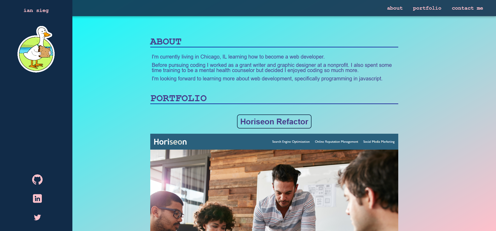
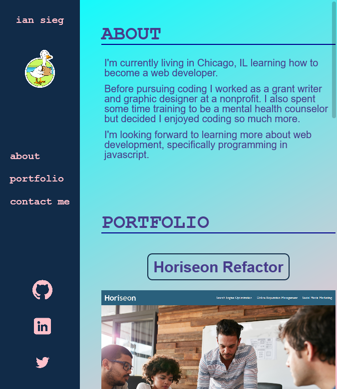

# 02-portfolio

## Description

This assignment tasked us with creating a portfolio of all of our web development work thus far in the course. Despite only having one other project to link to, we were asked to create placeholders for future projects, anticipating that this portfolio would be a living document updated regularly.

Doing this project was a great way for me to apply everything I've learned in CSS and HTML so far. I was able to create a, more or less, responsive website that would switch the nav bar to the lefthand side once the screen got too narrow. I also was able to (for the most part) properly control the flex properties of my elements and align them as I wanted.

Where I did run into some issues with proper spacing was dealing with images of different heights in the same flex box. My hope was to center the images themselves, but keep the headlines at the top of the container. I tried applying an absolute position to the titles, but that took them out of the flow of the document and messed up a lot of spacing downstream. Two workarounds I thought of were either editing the images in photoshop to ensure they all had identical pixel heights, or taking the headlines out of the flexbox container, into a new container that wouldn't be affected by justify-content. Both of these workarounds seemed a bit sloppy so I'd like to work out a cleaner solution.

## Links

- [Deployed Webpage](https://en-moss.github.io/02-portfolio/)

## Screenshots

